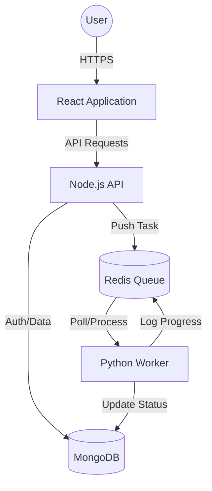

# 🚀 AI Task Platform

[](https://nodejs.org/)
[](https://reactjs.org/)
[](https://www.python.org/)
[](https://redis.io/)
[](https://kubernetes.io/)
[](https://www.docker.com/)

**The AI Task Platform** is a robust, production-ready full-stack application designed to scale background task processing. Built with the MERN stack, it leverages a high-performance Python worker and Redis-based task queue to handle intensive computations asynchronously.

## ✨ Core Features

- 🔐 **Secure Authentication**: JWT-based authentication system with protected routes.
- ⚡ **Background Processing**: Redis-queued tasks handled by a dedicated Python worker.
- 📊 **Real-time Monitoring**: Live status updates and execution logs for every task.
- 🎨 **Modern UI/UX**: Premium glassmorphism design with responsive layouts and smooth animations.
- 🏗️ **Microservices Architecture**: Completely containerized components (Frontend, Backend, Worker).
- 🔄 **Automated CI/CD**: Seamless deployment pipeline using GitHub Actions and ArgoCD on Kubernetes.

## 🛠️ Technology Stack

| Component | Technology | Role |
| :--- | :--- | :--- |
| **Frontend** | React, Tailwind CSS, Lucide Icons | Modern interactive UI |
| **Backend** | Node.js, Express, Mongoose | API Gateway & Service Logic |
| **Database** | MongoDB | Persistent Data Storage |
| **Task Queue** | Redis + Bull (Backend side) | Distributed Task Buffering |
| **Worker** | Python (Redis-py / Custom Queue) | Heavy-duty task execution |
| **Infrastructure** | Kubernetes (K8s), Docker | Orchestration & Containerization |
| **CI/CD** | GitHub Actions, ArgoCD | Automation & GitOps |

## 📐 Architecture Overview



## 🚀 Getting Started

### Prerequisites

- Node.js (v18+)
- Python (v3.9+)
- Docker & Docker Compose
- Redis (Local or Container)
- MongoDB (Local or Container)

### Local Development

1.  **Clone the Repository**
    ```bash
    git clone https://github.com/vanshsuri07/ai-task-platform.git
    ```

2.  **Setup Environment Variables**
    Configure `.env` files in both `backend` and `frontend` directories based on the provided `.env.example`.

3.  **Run with Docker Compose**
    The easiest way to get started is by using the pre-configured Docker orchestration:
    ```bash
    docker-compose up --build
    ```

4.  **Access the Platform**
    - **Frontend**: http://localhost:5173
    - **Backend API**: http://localhost:5000

## 🛳️ Deployment (Kubernetes)

The infrastructure is managed using GitOps principles. The deployment manifests are located in the [Infra Repository](https://github.com/vanshsuri07/ai-task-platform-infra).

- **CI**: GitHub Actions builds and pushes Docker images.
- **CD**: Tags are updated in the infra repo, and **ArgoCD** automatically synchronizes the cluster state.

---

Built with ❤️ by [Vansh Suri](https://github.com/vanshsuri07)
